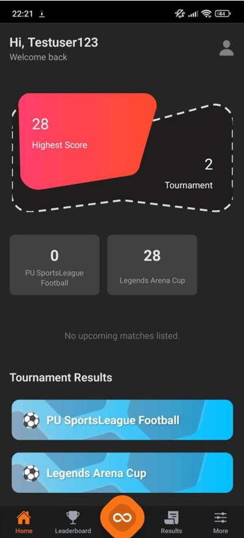
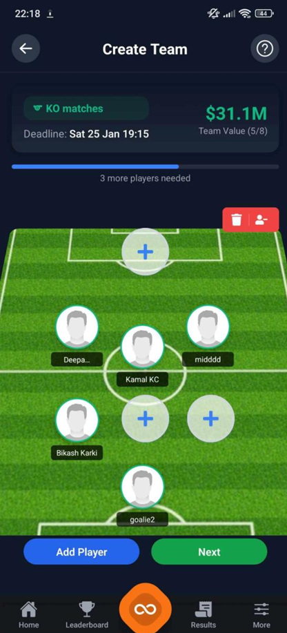
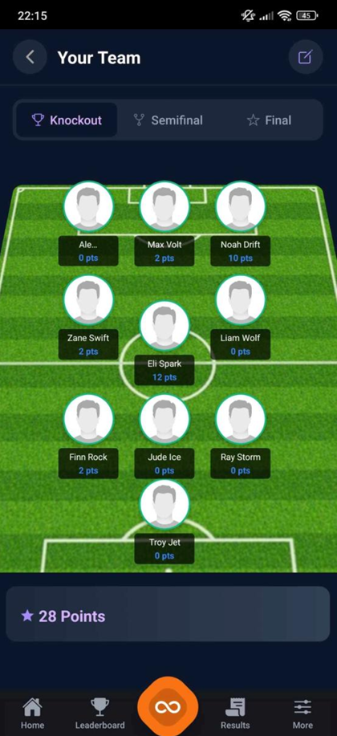
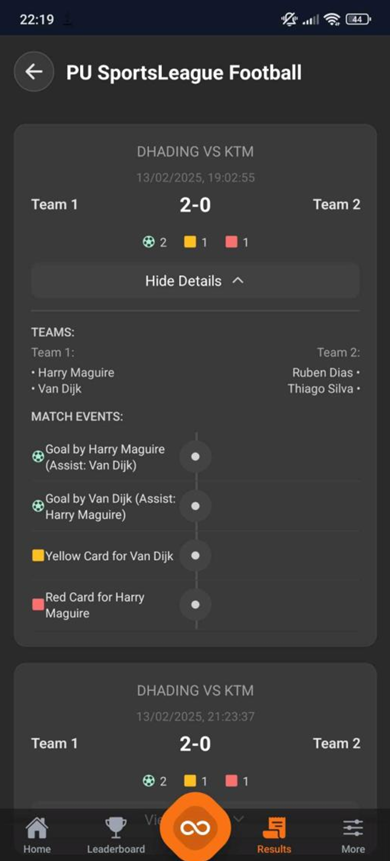
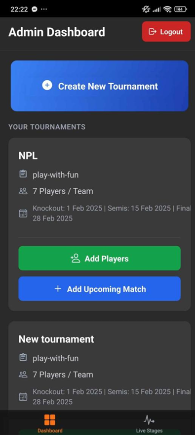
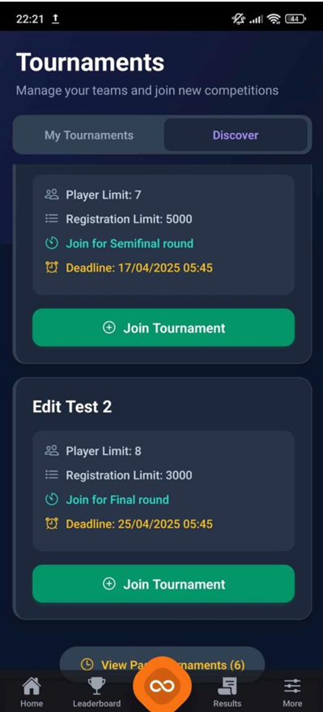

# Tournament Fantasy Management System 🏏⚽

> **Bring the thrill of Fantasy Sports to your local tournaments.**

A comprehensive mobile-based SaaS platform designed to manage fantasy sports leagues for cricket and football. Built with **React Native (Expo)**, it empowers organizers to host tournaments and allows fans to draft teams, track live scores, and compete on real-time leaderboards.

---

## 📖 About the Project

Most fantasy sports platforms cater only to major international leagues, leaving local tournaments and community matches behind. This disconnects fans from the games happening in their own backyards.

**The Tournament Fantasy Management System** bridges this gap. It is a specialized solution for:
*   **Local Organizers**: Who need a simple way to manage leagues and track scores without expensive automated feeds.
*   **Fans & Players**: Who want to participate actively by managing their own fantasy teams for local matches.

### Why this platform?
*   **For Small & Large Tournaments**: Scalable design that fits neighborhood leagues or university championships.
*   **Manual Score Management**: Admin dashboard allows for real-time score updates even without API data feeds.
*   **Engaging User Experience**: Professional-grade interface for drafting teams and viewing leaderboards.

---

## ✨ Key Features

### 📱 For Users (Fantasy Managers)
*   **Build Your Dream Team**: Draft players within a virtual budget and strategy.
*   **Real-Time Action**: Watch your score update live as the match progresses.
*   **Leaderboards**: Compete against friends and the community for the top spot.
*   **Social Engagement**: Participate in polls and match predictions.

### 🛡️ For Admins (Organizers)
*   **Tournament Control**: Create tournaments, set rules, and manage player pools.
*   **Live Scorekeeping**: Easy-to-use interface for updating match scores manually.
*   **Automated Rankings**: The system calculates points and updates leaderboards instantly.
*   **User Management**: Handle registrations and monitor platform usage.

---

## 📸 App Screenshots

### User Experience
| Home Dashboard | Team Creation |
|:---:|:---:|
|  |  |

| Live Points | Match Results |
|:---:|:---:|
|  |  |

### Admin Dashboard
| Create Tournament | Tournament Details |
|:---:|:---:|
|  |  |

---

## 🛠 Tech Stack

| Layer | Technology |
| :--- | :--- |
| **Framework** | React Native (Expo) |
| **Routing** | Expo Router |
| **Styling** | NativeWind (Tailwind CSS) |
| **State Mgmt** | Recoil & React Context |
| **API Calls** | Axios |
| **Backend** | Node.js + Express.js (Separate Repo) |
| **Database** | MongoDB |

---

## 📂 Project Structure

```
fantasy-sports-app/
├── app/                    # Main application source
│   ├── (admin)/            # Admin specific routes
│   ├── (auth)/             # Authentication routes
│   ├── (tabs)/             # Main tab navigation
│   ├── adminComponents/    # Admin UI components
│   ├── components/         # Shared UI components
│   ├── config/             # Configuration (Axios, Cloudinary)
│   ├── context/            # React Context (Auth)
│   ├── services/           # API services
│   ├── utils/              # Helper functions
│   ├── _layout.jsx         # Root layout
│   └── index.jsx           # Entry point
├── assets/                 # Images, animations (Lottie)
├── app.json                # Expo configuration
├── babel.config.js         # Babel configuration
├── package.json            # Dependencies
└── tailwind.config.js      # Tailwind configuration
```

---

## 🏁 Getting Started

### Prerequisites
*   Node.js (v16 or higher)
*   npm or yarn
*   Expo Go app on your mobile device (iOS/Android)

### Installation

1.  **Clone the Repository**
    ```bash
    git clone https://github.com/SurajAdhikari01/fantasy-sports-app.git
    cd fantasy-sports-app
    ```

2.  **Install Dependencies**
    ```bash
    npm install
    ```

3.  **Configure Environment**
    *   Check `app/config/axios.js` to ensure the API URL points to your backend server.
    *   If running locally, ensure your mobile device is on the same network as your PC.

4.  **Start the Application**
    ```bash
    npx expo start
    ```

5.  **Run on Device**
    *   Scan the QR code with the **Expo Go** app (Android) or Camera app (iOS).
    *   Press `a` to run on Android Emulator or `i` to run on iOS Simulator.

---

## 🤝 Contributing

Contributions are welcome! Please fork the repository and submit a pull request.

## 📄 License

This project is licensed under the MIT License.
